# Instrukcja obsługi panelu administracyjnego

Ten dokument opisuje wszystkie funkcje panelu administracyjnego platformy kursowej.

## Spis treści

1. [Dashboard](#1-dashboard)
2. [Zarządzanie kursami](#2-zarządzanie-kursami)
3. [Struktura kursu (moduły i lekcje)](#3-struktura-kursu)
4. [Edycja lekcji](#4-edycja-lekcji)
5. [Quizy i zadania domowe](#5-quizy-i-zadania-domowe)
6. [Zarządzanie studentami](#6-zarządzanie-studentami)
7. [Strony CMS](#7-strony-cms)
8. [Zamówienia i płatności](#8-zamówienia-i-płatności)
9. [Wiadomości](#9-wiadomości)

---

## 1. Dashboard

Po zalogowaniu jako administrator i kliknięciu w "Panel admina", zobaczysz główny panel z podsumowaniem najważniejszych statystyk.


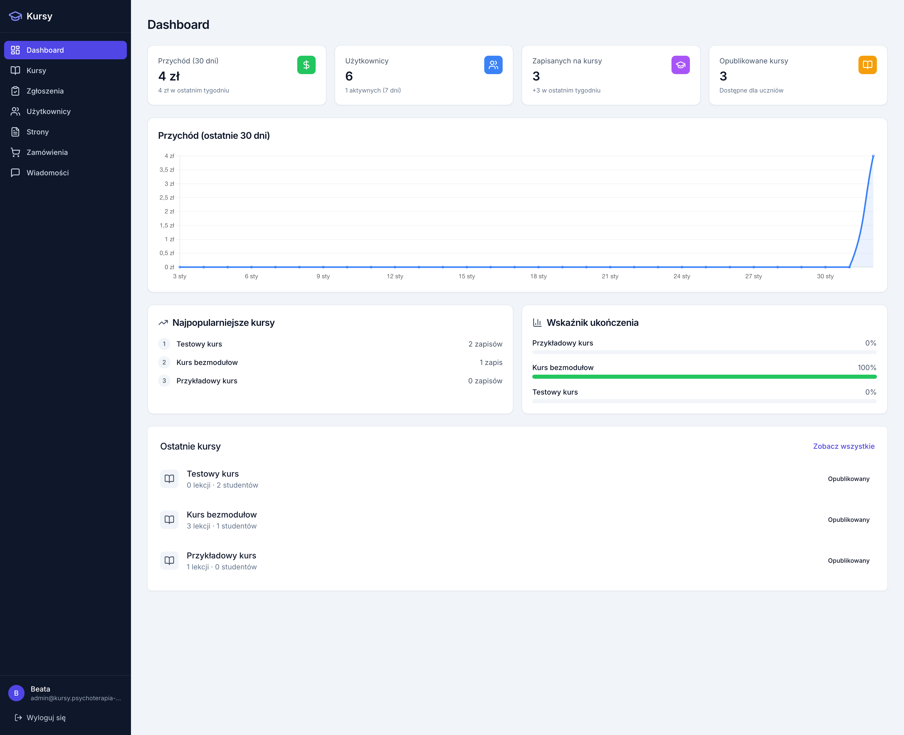

### Elementy dashboardu:

- **Łączny przychód** - suma wszystkich zrealizowanych płatności
- **Liczba kursów** - ile kursów zostało utworzonych
- **Liczba studentów** - ilu użytkowników jest zarejestrowanych
- **Wykres sprzedaży** - wizualizacja przychodów w czasie

### Menu nawigacyjne:

W lewym panelu znajdują się linki do wszystkich sekcji:
- Kursy
- Zgłoszenia (zadania domowe)
- Użytkownicy
- Strony
- Zamówienia
- Wiadomości

---

## 2. Zarządzanie kursami

### Lista kursów

Sekcja "Kursy" pokazuje wszystkie utworzone kursy z podstawowymi informacjami.


Dla każdego kursu widoczne są:
- Tytuł kursu
- Status (Szkic / Opublikowany)
- Cena
- Liczba zapisanych studentów
- Przyciski akcji (Edytuj / Usuń)

### Tworzenie nowego kursu

Kliknij przycisk **"Nowy kurs"** aby utworzyć nowy kurs.

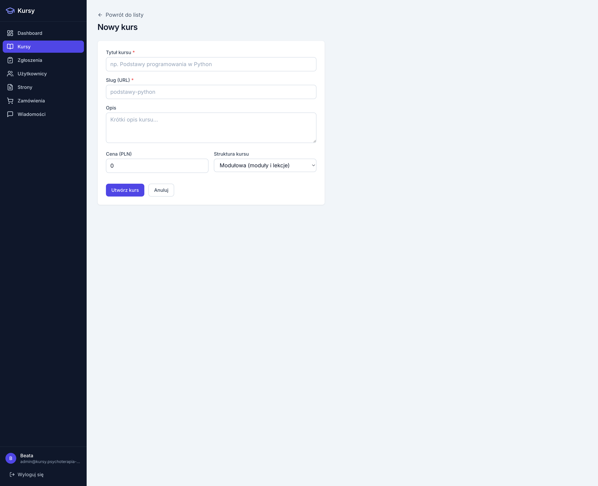

Wymagane pola:
- **Tytuł** - nazwa kursu wyświetlana studentom
- **Slug** - adres URL kursu (np. `moj-kurs` da URL `https://kursy.psychoterapia-plock.pl/c/moj-kurs`)

Po utworzeniu kursu zostaniesz przekierowany do edycji.

---

## 3. Struktura kursu

Edycja kursu podzielona jest na kilka zakładek.

### Zakładka "Ogólne"

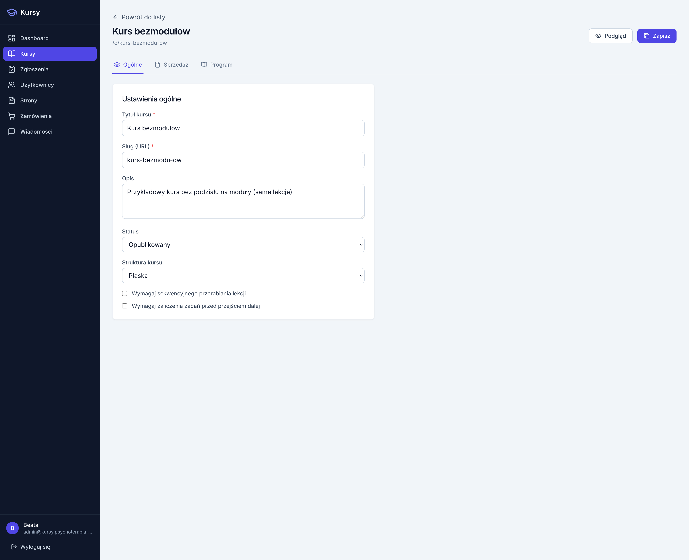

Podstawowe informacje o kursie:
- **Tytuł** - nazwa kursu
- **Slug** - adres URL
- **Opis** - krótki opis wyświetlany w katalogu
- **Miniatura** - URL do obrazka kursu
- **Status** - Szkic (niewidoczny) lub Opublikowany (widoczny dla wszystkich)

### Zakładka "Sprzedaż"

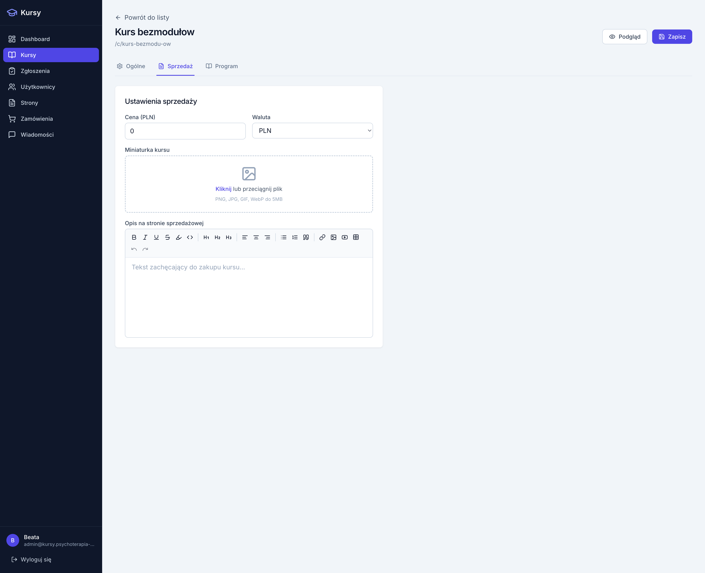

Konfiguracja płatności:
- **Cena** - kwota w groszach (np. 9900 = 99 zł)
- **Waluta** - PLN
- **Treść strony sprzedażowej** - opis wyświetlany na stronie zakupu (obsługuje podstawowe formatowanie, pogrubianie, tabele itp.)

### Zakładka "Program"

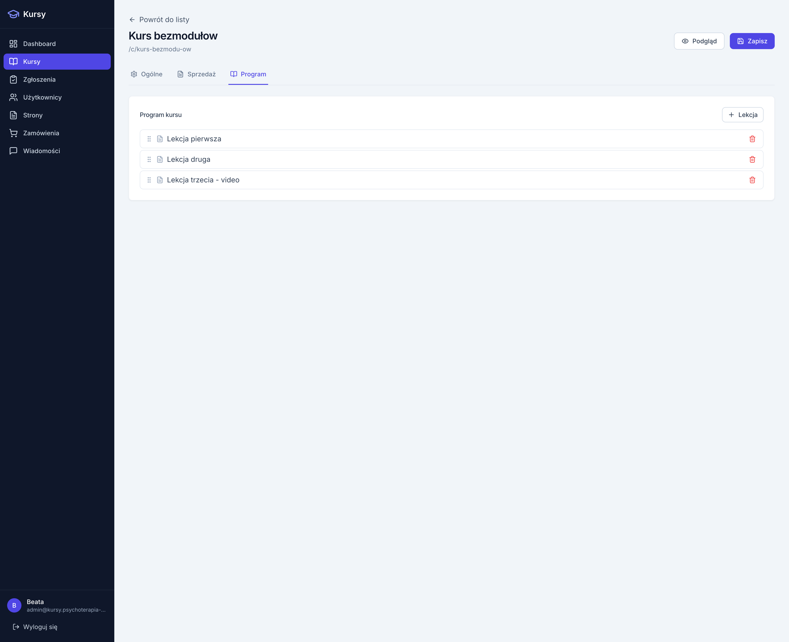

Tutaj zarządzasz strukturą kursu:

#### Moduły
Kurs składa się z modułów (sekcji tematycznych). Każdy moduł może zawierać wiele lekcji.

- Kliknij **"Dodaj moduł"** aby utworzyć nowy moduł
- Przeciągaj moduły aby zmienić ich kolejność
- Użyj ikony ołówka aby edytować nazwę modułu
- Użyj ikony kosza aby usunąć moduł

#### Lekcje
Każdy moduł zawiera lekcje - pojedyncze jednostki nauki.

- Kliknij **"Dodaj lekcję"** w wybranym module
- Przeciągaj lekcje aby zmienić kolejność (również między modułami)
- Kliknij na lekcję aby przejść do jej edycji

#### Drip Content (Udostępnianie stopniowe)

Możesz ustawić opóźnienie dla każdej lekcji w polu **"Dni od zapisu"**, np.:
- `0` - lekcja dostępna od razu po zapisie
- `7` - lekcja odblokuje się 7 dni po zapisaniu studenta
- `14` - lekcja odblokuje się po 2 tygodniach

Dzięki temu możesz stopniowo udostępniać materiały, zamiast dawać dostęp do wszystkiego od razu.

---

## 4. Edycja lekcji

Po kliknięciu na lekcję otwiera się edytor.

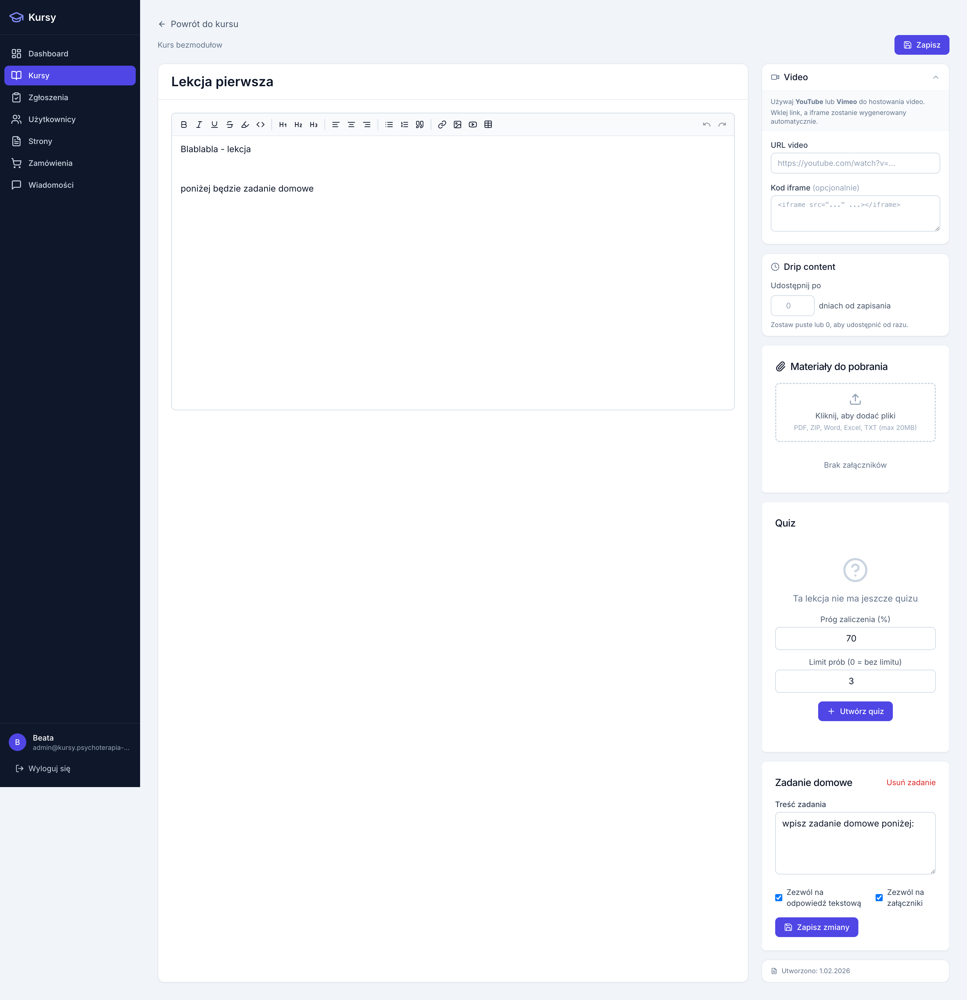

### Podstawowe pola:

- **Tytuł** - nazwa lekcji
- **Treść** - główna zawartość lekcji (obsługuje Markdown)
- **Video URL** - link do YouTube lub Vimeo

### Obsługiwane formaty video:

System automatycznie rozpoznaje linki:
- YouTube: `https://www.youtube.com/watch?v=XXXX` lub `https://youtu.be/XXXX`
- Vimeo: `https://vimeo.com/XXXX`

Video zostanie osadzone bezpośrednio w lekcji. Filmy nie muszą być ustawione jako publiczne, wystarczy, że będą ustawione jako

### Markdown w treści

Treść lekcji obsługuje składnię Markdown:

```markdown
# Nagłówek 1
## Nagłówek 2

**Pogrubiony tekst**
*Kursywa*

- Lista punktowana
- Kolejny punkt

1. Lista numerowana
2. Kolejny punkt

[Link](https://example.com)

`kod inline`

​```javascript
// blok kodu
const x = 1;
​```
```

Ale możesz też po prostu klikać jak w Wordzie i powinno to działać.


## 5. Quizy i zadania domowe

### Quiz

Każda lekcja może mieć przypisany quiz sprawdzający wiedzę.

Aby dodać quiz:
1. Otwórz edycję lekcji
2. Przejdź do sekcji "Quiz"
3. Dodaj pytania i odpowiedzi
4. Zaznacz poprawne odpowiedzi

Student musi zaliczyć quiz aby oznaczyć lekcję jako ukończoną.

### Zadanie domowe

Zadania domowe pozwalają studentom przesyłać własne prace do oceny.

Konfiguracja zadania:
1. W edycji lekcji włącz opcję "Zadanie domowe"
2. Opisz wymagania w polu "Instrukcja zadania"
3. Ustaw czy zadanie jest wymagane do ukończenia lekcji

### Zgłoszenia (Submissions)

W sekcji **"Zgłoszenia"** w menu głównym znajdziesz wszystkie przesłane zadania domowe.

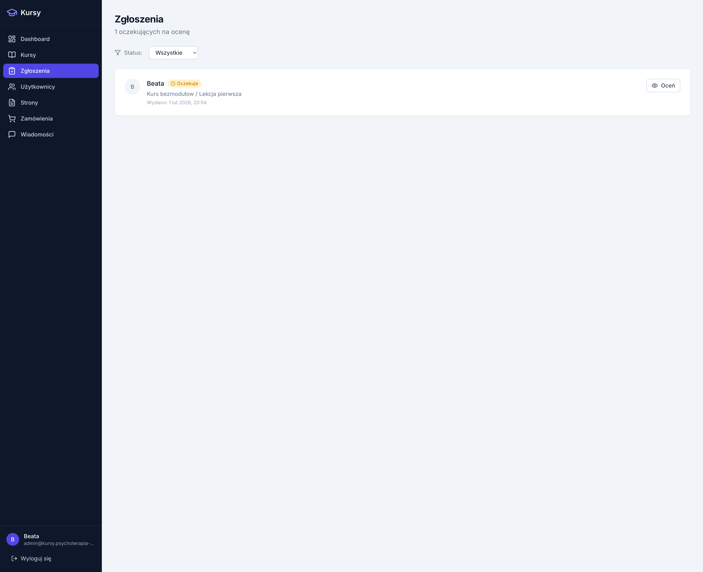

Po kliknięciu "Oceń" zobaczysz szczegóły zgłoszenia:

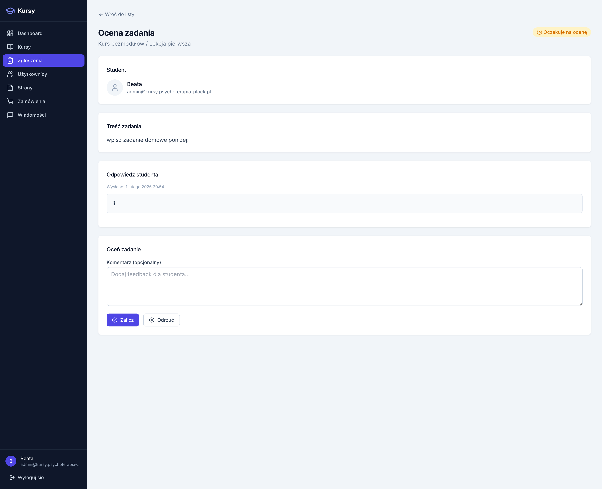

Dla każdego zgłoszenia możesz:
- Przeczytać odpowiedź studenta
- Dodać komentarz/feedback
- Zaakceptować lub odrzucić zgłoszenie

---

## 6. Zarządzanie studentami

### Lista użytkowników

Sekcja **"Użytkownicy"** pokazuje wszystkich zarejestrowanych użytkowników.

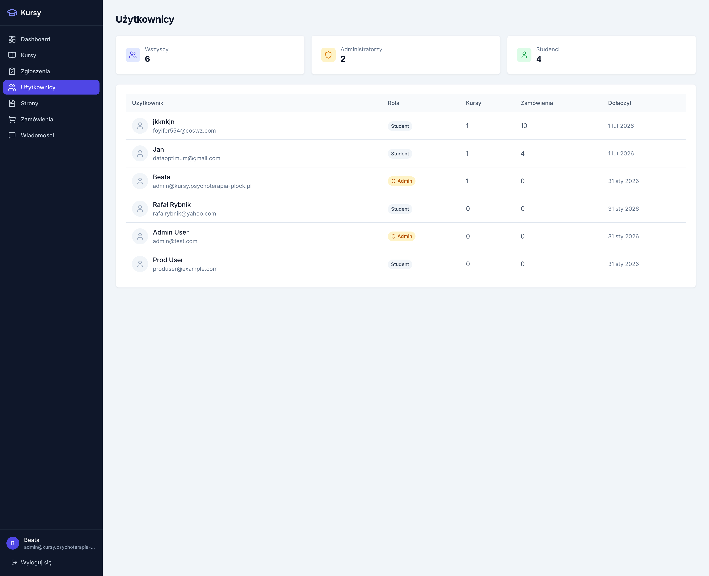

Informacje o użytkowniku:
- Email
- Imię i nazwisko
- Data rejestracji
- Rola (Student / Admin)
- Liczba zapisanych kursów
- Liczba zamówień

### Edycja użytkownika

Kliknij przycisk **"Edytuj"** przy wybranym użytkowniku, aby otworzyć stronę edycji.

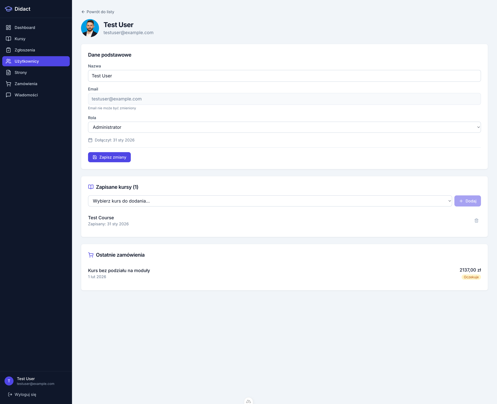

Na stronie edycji możesz:
- Zmienić nazwę użytkownika
- Zmienić rolę (Student ↔ Administrator)
- Zobaczyć listę zapisanych kursów
- Ręcznie dodać użytkownika do kursu
- Usunąć użytkownika z kursu
- Zobaczyć historię zamówień

### Ręczne zapisanie do kursu

Możesz ręcznie zapisać użytkownika do kursu (np. po płatności przelewem):
1. Znajdź użytkownika na liście i kliknij "Edytuj"
2. W sekcji "Zapisane kursy" wybierz kurs z listy rozwijanej
3. Kliknij "Dodaj"

Użytkownik natychmiast otrzyma dostęp do kursu.

### Usunięcie z kursu

Aby usunąć użytkownika z kursu:
1. Otwórz edycję użytkownika
2. Znajdź kurs na liście "Zapisane kursy"
3. Kliknij ikonę kosza przy kursie
4. Potwierdź usunięcie

**Uwaga:** Usunięcie zapisu spowoduje utratę postępu użytkownika w kursie.

### Role użytkowników

- **Student** - domyślna rola, dostęp tylko do zakupionych kursów
- **Admin** - pełny dostęp do panelu administracyjnego

---

## 7. Strony CMS

Sekcja **"Strony"** pozwala tworzyć statyczne strony (regulamin, polityka prywatności, o nas itp.).

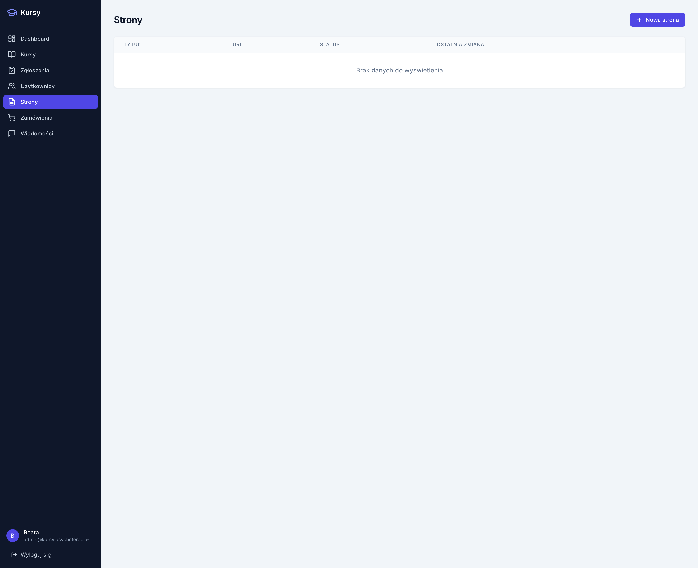

### Tworzenie strony

1. Kliknij "Nowa strona"
2. Wypełnij:
   - **Tytuł** - nagłówek strony
   - **Slug** - adres URL (np. `regulamin` da `/regulamin`)
   - **Treść** - zawartość strony (Markdown)
   - **Status** - Szkic lub Opublikowana
3. Zapisz

### Linkowanie do stron

Strony są dostępne pod adresem `/{slug}`, np.:
- `/regulamin`
- `/polityka-prywatnosci`
- `/kontakt`

---

## 8. Zamówienia i płatności

### Lista zamówień

Sekcja **"Zamówienia"** pokazuje historię wszystkich transakcji.

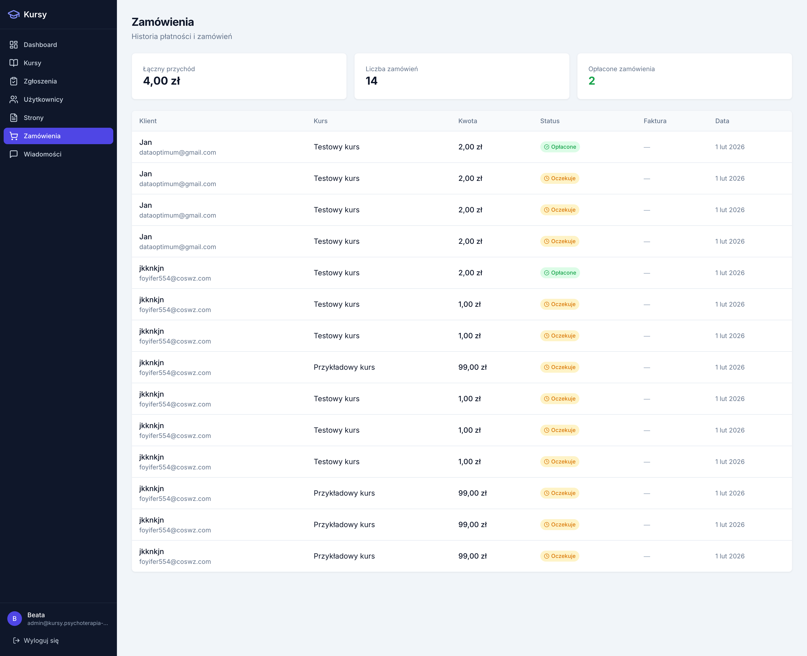

Dla każdego zamówienia widoczne są:
- Data
- Użytkownik (email)
- Kurs
- Kwota
- Status (Oczekujące / Opłacone / Anulowane)
- ID sesji Stripe

### Statusy zamówień

- **PENDING** - oczekuje na płatność (użytkownik rozpoczął checkout)
- **COMPLETED** - płatność zrealizowana, student zapisany do kursu
- **FAILED** - płatność nie powiodła się
- **REFUNDED** - zwrot pieniędzy

### Płatności Stripe

System obsługuje płatności przez Stripe:
- **Karty płatnicze** - Visa, Mastercard, etc.
- **BLIK** - szybkie płatności mobilne

Po udanej płatności:
1. Stripe wysyła webhook do systemu
2. Zamówienie zmienia status na COMPLETED
3. Student zostaje automatycznie zapisany do kursu
4. Student otrzymuje email z potwierdzeniem

---

## 9. Wiadomości

Sekcja **"Wiadomości"** to wewnętrzny system komunikacji ze studentami.

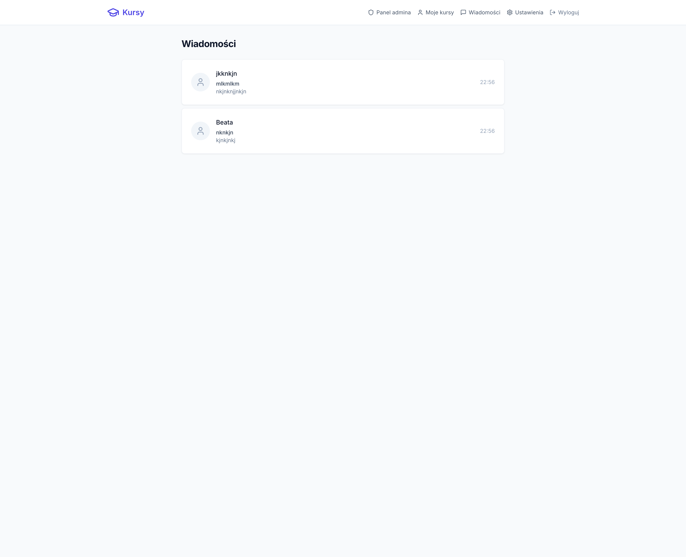

### Wątki

Wiadomości są grupowane w wątki. Każdy wątek może być powiązany z konkretnym kursem lub lekcją.

### Odpowiadanie na wiadomości

1. Kliknij na wątek aby go otworzyć
2. Przeczytaj wiadomość studenta
3. Wpisz odpowiedź w polu tekstowym
4. Kliknij "Wyślij"

Student otrzyma powiadomienie email o nowej wiadomości (jeśli ma włączone powiadomienia).

### Rozpoczynanie nowego wątku

Jako admin możesz również rozpocząć nowy wątek:
1. Kliknij "Nowa wiadomość"
2. Wybierz adresata
3. Wpisz temat i treść
4. Wyślij

---

## Wskazówki i dobre praktyki

### Organizacja kursów

1. **Planuj strukturę** - przed rozpoczęciem nagrywania zaplanuj moduły i lekcje
2. **Krótkie lekcje** - lepsze są krótkie, skupione lekcje (5-15 min) niż długie wykłady
3. **Drip content** - rozważ stopniowe udostępnianie, aby studenci nie byli przytłoczeni

### Strona sprzedażowa

1. **Jasna propozycja wartości** - co student zyska po ukończeniu kursu?
2. **Program kursu** - pokaż strukturę, aby student wiedział czego się spodziewać
3. **Cena** - minimalna cena to 2 PLN (ograniczenie Stripe)

### Komunikacja ze studentami

1. **Szybkie odpowiedzi** - staraj się odpowiadać na wiadomości w ciągu 24h
2. **Konstruktywny feedback** - przy ocenie zadań domowych dawaj konkretne wskazówki
3. **Proaktywność** - wysyłaj wiadomości zachęcające do kontynuacji kursu

---

## Rozwiązywanie problemów

### Student nie ma dostępu do kursu

1. Sprawdź czy płatność została zrealizowana (sekcja Zamówienia)
2. Jeśli płatność jest OK ale brak dostępu - sprawdź czy istnieje enrollment
3. W razie potrzeby ręcznie zapisz studenta do kursu

### Video nie wyświetla się

1. Sprawdź czy URL jest poprawny (YouTube lub Vimeo)
2. Upewnij się, że video ma włączone osadzanie (embedding)
3. Niektóre filmy mają wyłączone osadzanie przez właściciela

### Email nie został wysłany

Sprawdź konfigurację SMTP w zmiennych środowiskowych:
- `SMTP_HOST`
- `SMTP_PORT`
- `SMTP_USERNAME`
- `SMTP_PASSWORD`
- `MAIL_FROM_ADDRESS` - musi być autoryzowany w panelu dostawcy SMTP

---

## Kontakt z pomocą techniczną

W przypadku problemów technicznych skontaktuj się z deweloperem systemu.
